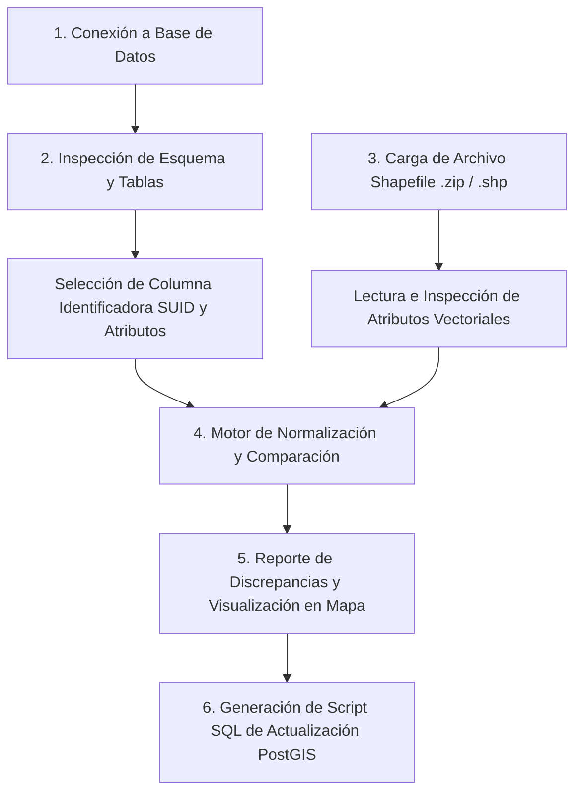

# Arquitectura y Diseño: Herramienta de Comparación Espacial SIG (DB vs. Shapefile)

Este documento detalla la arquitectura técnica, los principios de diseño y los algoritmos de procesamiento para la herramienta de comparación y sincronización de información geográfica entre tablas de bases de datos relacionales/PostGIS y archivos vectoriales Shapefile (.shp / .zip).

---

## 1. Visión General del Sistema

El objetivo principal es permitir a los usuarios (analistas SIG, administradores de bases de datos) correlacionar registros almacenados en una base de datos relacional con geometrías y atributos provenientes de archivos Shapefile.

### Diagrama del Flujo de Trabajo

---

## 2. Conceptos Clave del Dominio

### 2.1 Identificador Único Compartido (SUID - Shared Unique Identifier)
Es el campo o atributo primario utilizado para emparejar un registro de la base de datos con una entidad del archivo Shapefile (ej. `padron_id`, `gid`, `codigo_parcela`, `asset_id`).

### 2.2 Truncamiento a 10 Caracteres en Archivos DBF
Los archivos Shapefile utilizan el formato DBF para almacenar atributos alfanuméricos. La especificación dBase III limita los nombres de las columnas a un máximo de **10 caracteres**. 
- **Solución Algorítmica**: La herramienta realiza una coincidencia insensible a mayúsculas/minúsculas y prueba tanto el nombre completo de la columna como la versión truncada a los primeros 10 caracteres (`columna[:10]`).

### 2.3 Normalización de Cadenas SUID (`clean_suid_series`)
Para evitar falsas discrepancias por caracteres de control o formato:
1. Eliminación de espacios no separables (`\xa0`), saltos de línea (`\r\n\t`) y espacios laterales.
2. Eliminación de comillas simples y dobles laterales.
3. Eliminación del sufijo flotante `.0` en valores puramente numéricos (ejemplo: `'1002.0'` -> `'1002'`).

### 2.4 Normalización y Comparación de Atributos
1. Conversión de valores a minúsculas y eliminación de espacios en blanco laterales.
2. Tratamiento uniforme de valores nulos, `NaN`, `"none"`, `"nan"` como cadenas vacías `""`.
3. Comparación línea a línea de los campos seleccionados.

### 2.5 Comparación Geométrica y Reproyección CRS
1. **Reproyección de Sistemas de Referencia Espacial (CRS)**: Si el sistema de coordenadas de la base de datos (SRID) difiere del Shapefile, se reproyectan las geometrías al CRS de la base de datos antes de la comparación.
2. **Evaluación de Topología**: Comparación topológica exacta mediante predicados geométricos (`geom_equals`).

---

## 3. Tipos de Discrepancias Identificadas

1. **SUID Presente en DB pero Faltante en Shapefile**: El registro existe en la base de datos, pero no tiene entidad espacial en el Shapefile.
2. **SUID Presente en Shapefile pero Faltante en DB**: Existe una nueva entidad geográfica en el Shapefile que no está registrada en la tabla de la base de datos (`INSERT` pendiente).
3. **Discrepancia de Atributos (`ATTRIBUTE_MISMATCH`)**: El SUID coincide en ambas fuentes, pero uno o más campos seleccionados contienen valores diferentes.
4. **Diferencia Geométrica (`GEOMETRY_SHAPE`)**: El SUID coincide, pero los límites o la ubicación de la geometría han cambiado.

---

## 4. Estrategia de Implementación Técnica

- **Backend / API Router (Next.js API Routes / Servidor Node)**:
  - Manejo seguro de credenciales PostgreSQL (`pg` / `Knex`).
  - Prueba de conexión a base de datos.
  - Inspección de esquemas y columnas de tablas.
- **Frontend / Cliente (React + Leaflet + Turf.js / `shpjs`)**:
  - Interfaz gráfica limpia y modular (componentes atómicos).
  - Selector de conexión, tabla, SUID y atributos a comparar.
  - Visualización interactiva en mapa (capas con código de colores según el tipo de discrepancia).
  - Exportador de reportes CSV y generador de parches SQL para PostGIS.
