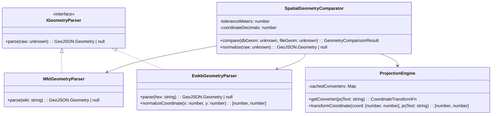

# Modular Utilities & OOP Architecture Guide

> **Scope**: `src/utils/`  
> **Status**: Active Architecture Standard  
> **Last Updated**: 2026-09-02  

---

## 1. Overview & Architectural Motivation

Previously, `src/utils/` contained 14 unorganized utility files at the root level, mixing binary stream readers, spatial projection logic, Leaflet DOM popup builders, and string formatting helpers.

To improve cohesion, maintainability, and domain isolation, `src/utils/` has been structured into **4 domain-specific subdirectories**:

```
src/utils/
├── binary/              # Low-level binary parsers & memory pool
│   ├── BinaryDbfReader.ts
│   ├── BinaryShpReader.ts
│   ├── ZipShapefileExtractor.ts
│   └── StringInternPool.ts
│
├── spatial/             # Projection, geometry decoding & spatial comparison
│   ├── ProjectionEngine.ts
│   ├── EwkbGeometryParser.ts
│   ├── WktGeometryParser.ts
│   ├── GeometryRawNormalizer.ts
│   ├── PolygonRingNormalizer.ts
│   ├── SpatialGeometryComparator.ts
│   └── GeoJsonDatasetBuilder.ts
│
├── map/                 # Leaflet layer styling, event binding & popups
│   ├── MapSymbologyStyler.ts
│   ├── MapEventHandler.ts
│   └── MapPopupPresenter.ts
│
└── common/              # Number/file formatting & string normalization
    ├── ValueFormatter.ts
    └── GisStringSanitizer.ts
```

---

## 2. Domain Subdirectories Breakdown

### 📦 `src/utils/binary/` — Binary Parsers & I/O
Designed for high-speed, zero-allocation memory operations capable of handling 1,000,000+ Shapefile features:
- **`BinaryShpReader.ts` (`BinaryShpReader`)**: Reads raw `.shp` binary buffers, builds index offsets, and lazy-decodes geometries with optional coordinate transformation.
- **`BinaryDbfReader.ts` (`BinaryDbfReader`)**: Parses dBase III/IV `.dbf` records with string interning to avoid garbage collection pressure on categorical fields.
- **`ZipShapefileExtractor.ts` (`ZipShapefileExtractor`)**: Concurrent in-memory `.zip` decompressor extracting `.shp`, `.dbf`, `.shx`, `.prj`, `.cpg`, and `.geojson` buffers.
- **`StringInternPool.ts` (`StringInternPool`)**: Memory-efficient deduplication cache for strings across massive tabular datasets.

### 🌐 `src/utils/spatial/` — Spatial Geometry & Projection Engine
Encapsulates spatial math, coordinate transformations, and topological comparison:
- **`ProjectionEngine.ts` (`ProjectionEngine`)**: Dynamically parses ESRI PRJ WKT or EPSG definitions via `proj4`, caches compiled converters, and converts metric/projected coordinates to geographic WGS84 (`EPSG:4326`) degrees.
- **`EwkbGeometryParser.ts` (`EwkbGeometryParser`)**: Decodes PostGIS Extended Well-Known Binary hex strings and converts UTM Zone 19S meters into latitude/longitude.
- **`WktGeometryParser.ts` (`WktGeometryParser`)**: Parses Well-Known Text (`POINT`, `LINESTRING`, `POLYGON`, `MULTIPOLYGON`) and generic geometry string cells.
- **`SpatialGeometryComparator.ts` (`SpatialGeometryComparator`)**: Performs topological comparison between database and file geometries with configurable spatial tolerance (~10m) and ring canonicalization.
- **`GeoJsonDatasetBuilder.ts` (`GeoJsonDatasetBuilder`)**: Scans tabular query rows and generates validated GeoJSON `FeatureCollection` datasets.

### 🗺️ `src/utils/map/` — Leaflet Map Presenters & Interactivity
Encapsulates Leaflet presentation, symbology, and event handling:
- **`MapSymbologyStyler.ts` (`MapSymbologyStyler`)**: Resolves stroke colors, fill opacities, dash arrays, and circle markers for regular and discrepancy features.
- **`MapPopupPresenter.ts` (`MapPopupPresenter`)**: Assembles formatted HTML popup cards with attribute tables and discrepancy badges.
- **`MapEventHandler.ts` (`MapEventHandler`)**: Connects click and selection events between Leaflet vector layers and the application state.

### 🛠️ `src/utils/common/` — Value Formatters & Sanitizers
General utilities shared across UI components:
- **`ValueFormatter.ts` (`ValueFormatter`)**: Formats numbers and byte sizes with standard locale (`es-UY`).
- **`GisStringSanitizer.ts` (`GisStringSanitizer`)**: Cleans whitespace, removes quotes, strips trailing `.0`, and normalizes SUID keys.

---

## 3. Object-Oriented (OOP) Design Patterns & Evolution

The utility architecture is designed to evolve into Object-Oriented Domain Services:



### Applied Patterns
1. **Strategy Pattern (`IGeometryParser`)**: Polymorphic parsers for WKT, EWKB, and GeoJSON.
2. **Factory / Singleton Pattern (`ProjectionEngine`)**: Manages `proj4` instances and caches compiled projection transforms.
3. **Domain Service Pattern (`SpatialGeometryComparator`)**: Encapsulates tolerance thresholds, ring sorting, and vertex matching.
4. **Presenter Pattern (`MapSymbologyStyler`, `MapPopupPresenter`)**: Encapsulates Leaflet-specific presentation logic away from UI components.

---

## 4. Import Conventions & Rules

- **Direct Subdirectory Imports**: Import directly from the categorized subfolder (e.g., `import { formatNumber } from "@/utils/common/formatters";`).
- **No Barrel Re-exports**: Avoid barrel `index.ts` files to maximize tree-shaking efficiency and prevent circular dependencies.
- **Self-Descriptive Variables**: All utility methods strictly adhere to the workspace rule prohibiting single-letter variable names.
